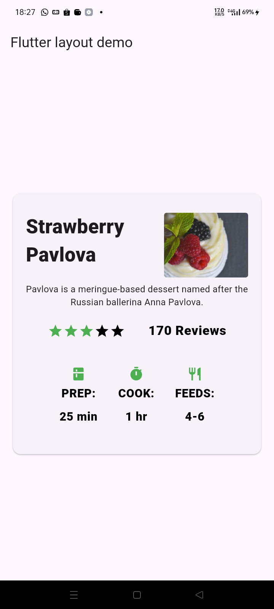
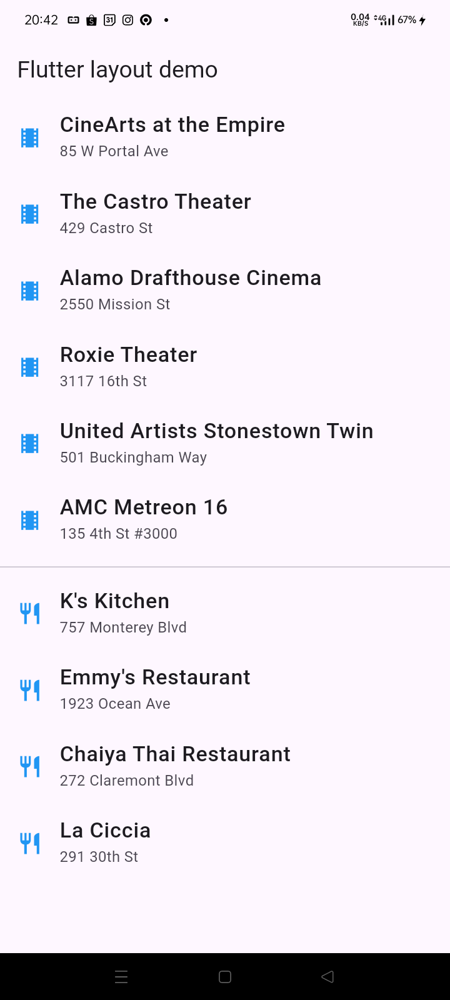
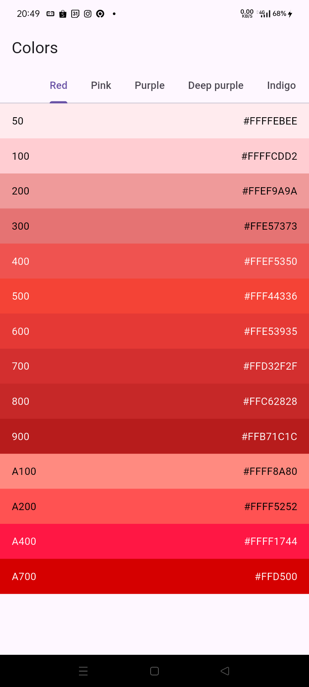
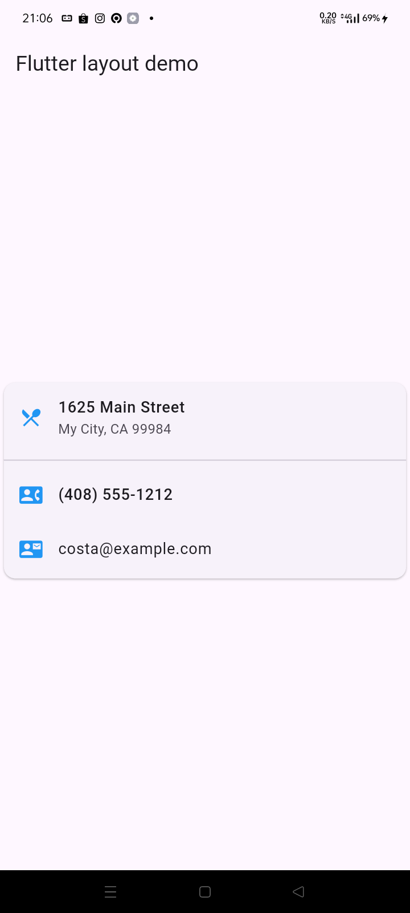
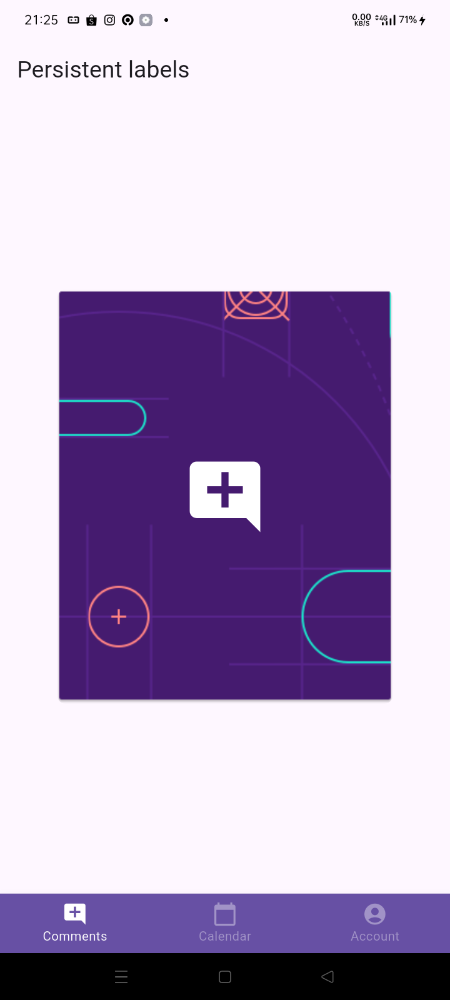
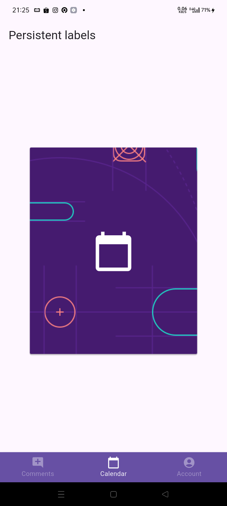
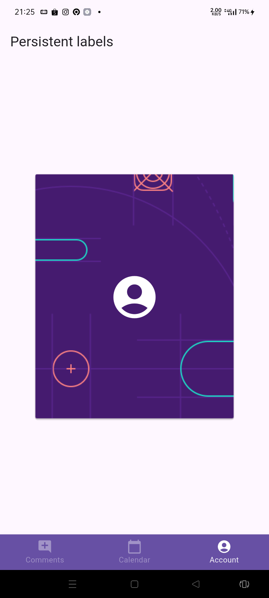

# basic_layout_flutter

Working on the Codelabs exercises, Lab Assignment 1, Question 2

Some results from each practice step

Aligning, Sizing, and Packing Widgets

Nesting Rows and Columns

Layout Container

Layout Gridview

Layout Gridview List

Layout Listview

Card and Stack
