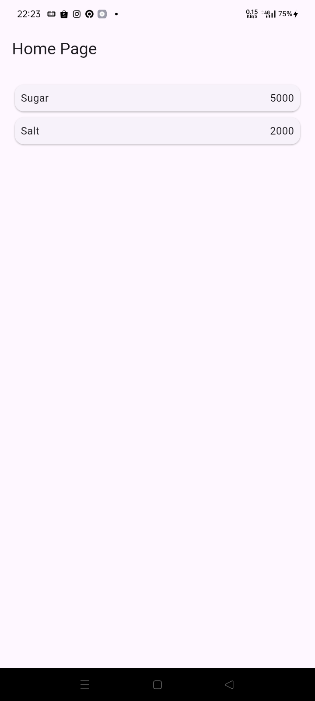
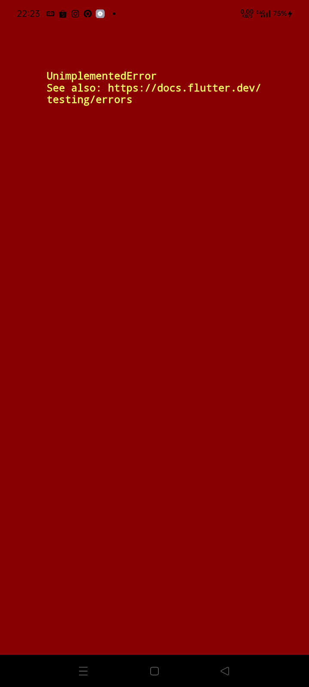
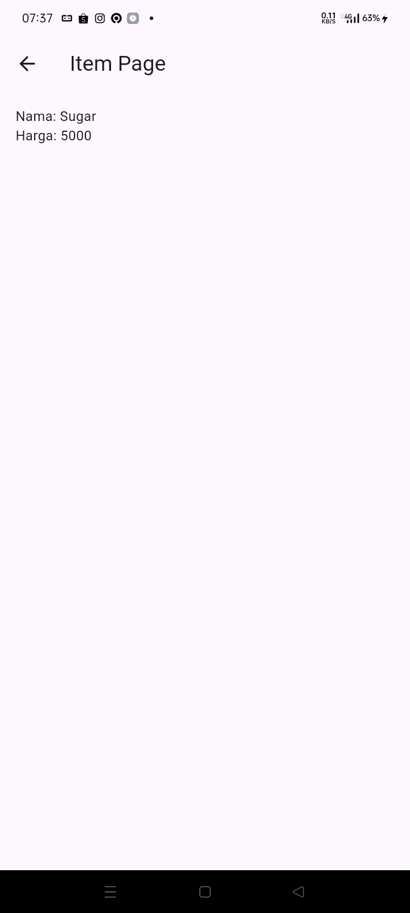
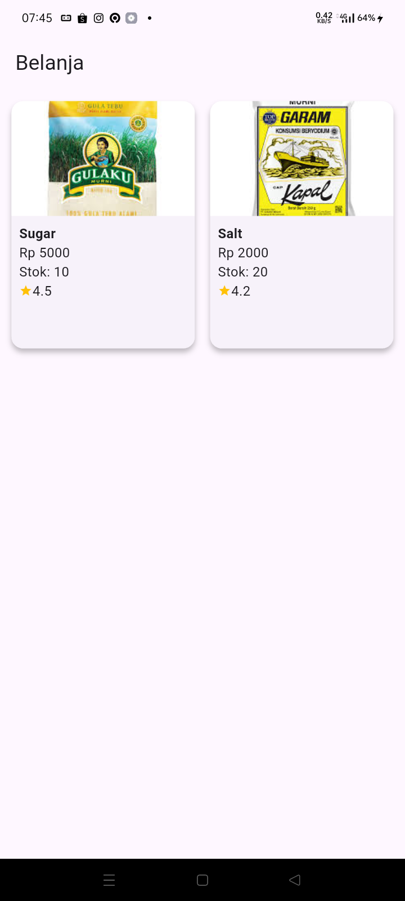
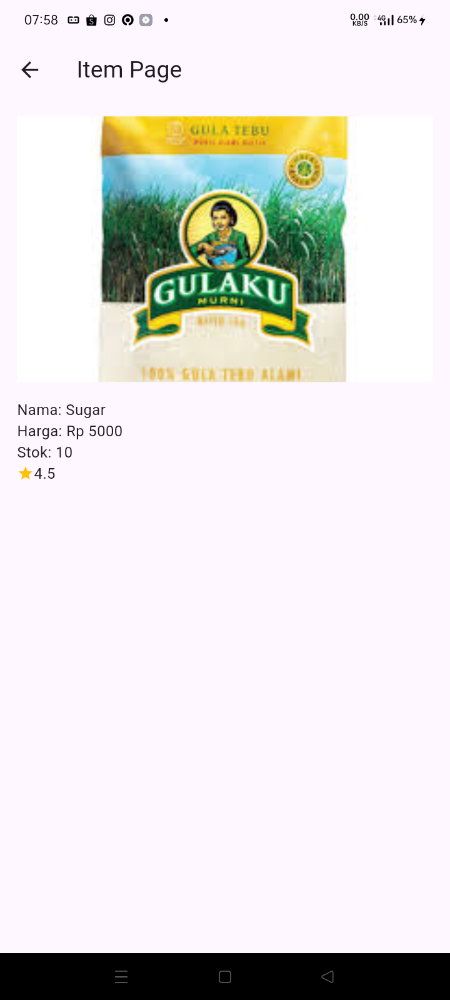
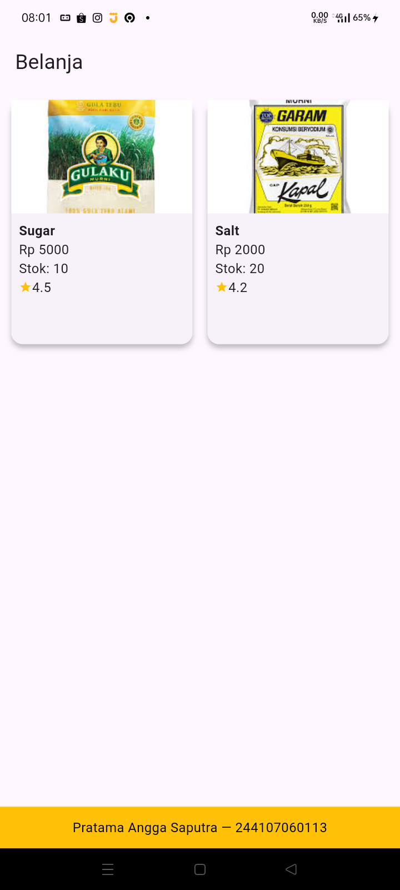

# belanja

Learning navigation in Flutter

Some results from each practice step

Folder Structure

Results of the first step

Results of the second step

Results of the third step

Results of the fourth step

Results of the fifth step

Results of the sixth step

Completion of Lab Assignment 2, from number 1 to the last one

